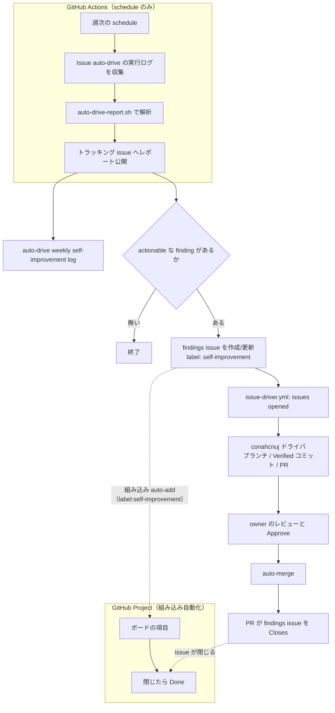

# 自己研鑽（週次の auto-drive ログ解析）

「Issue auto-drive」の実行ログは Actions の実行ログとしてしか残りません。毎週、
その週の実行を解析して次の改善へつなぐ自己研鑽ループが `bin/auto-drive-report.sh`
と `bin/auto-drive-workflow.sh` です。ドライバ自身が自分の失敗（バグ報告・
全モデル失敗・時間予算枯渇・想定外の終わり方）を拾って、GitHub Project の
ボードに載る作業項目として次の実行へ渡します。

- 解析は純 bash + awk で offline に動く（jq / node 不要）
- 通信は `gh` CLI のみ。テストはモック `gh` を使う
  （`driver-tests/auto-drive-report.sh` / `auto-drive-workflow.sh`）
- 週次ワークフローは schedule だけで起動し、人手の入力は無い

## 改善プロセス（プロジェクト管理）

要点:

- **ラベルがループの唯一の目印**。findings issue に付く `self-improvement` を、
  `issue-driver.yml`（bot 作成 issue の例外）と Project の組み込み auto-add が
  それぞれ読む。人手で指定する入力は無い。
- **findings issue は App 名義で作成する**。`GITHUB_TOKEN` で作った issue は
  workflow を起動しないため、`issues: opened` でドライバを動かすには App の
  インストールトークンが必要（`gh-app/get-token.sh` を workflow が使う）。
- **Projects API は呼ばない**。`GITHUB_TOKEN` は Projects v2 に到達できず、
  ユーザー所有の Project は App のインストール対象外のため、Project 側の
  組み込み auto-add に載せる。Project で一度だけ
  **Settings → Workflows → Auto-add to project** を有効にし、フィルタを
  `label:self-improvement` にする。任意で「item closed → Done」も有効にする。

## ファイル

| パス | 役割 |
| --- | --- |
| `bin/auto-drive-report.sh` | ログ解析。ログのパス群を渡すと markdown レポートを stdout へ出力。`--runs-url-prefix` で `run-<id>.log` に実行 URL を付ける。先頭のメタ行 `<!-- auto-drive-report runs=N findings=N actionable=N -->` が機械可読な要約 |
| `bin/auto-drive-workflow.sh` | 週次ループの実体。Actions API で直近のログを集め、レポートをトラッキング issue に載せ、actionable な finding があれば findings issue を更新して `self-improvement` を付ける |
| `.github/workflows/weekly-self-improvement.yml` | 上をスケジュールで回す（月曜 01:17 UTC）。入力は無く、App 鍵を stage して findings issue だけ App 名義で作る |

## 手順

1. **収集**: `gh api` で `issue-driver.yml` の直近 `--lookback-days`（既定 `7`）の
   完了済み run を取得し、`gh run view --log` でログをダウンロード
   （ダウンロード量には上限がある）。ログが取れない run は WARNING 扱いでスキップ
2. **解析**: `auto-drive-report.sh` でレポートを作成（stdout）。先頭のメタ行
   `<!-- auto-drive-report runs=N findings=N actionable=N -->` が機械可読な要約
3. **公開**: レポートをトラッキング issue「auto-drive weekly self-improvement log」へ
   （初回のみ作成、以降はコメント追記）
4. **引き渡し**: `actionable > 0` のとき、findings を「auto-drive findings」issue に
   まとめ、`self-improvement` ラベルを付ける。新規作成なら `issues: opened` で、
   既存 issue への追記なら `workflow_dispatch` の再試行で、ドライバを起動する

## finding の分類

| アウトカム | 例 | 種別 |
| --- | --- | --- |
| `environment-down` | 全プロバイダが環境エラーで終了 | informational |
| `handoff-unconfirmed` | レビュー依頼の読み返しが読めなかった | informational |
| `models-without-round` | どのモデルもラウンドを持たなかった | informational |
| `no-model-completed` | どのモデルも完了できなかった | actionable |
| `time-budget-exhausted` | `CONAHCNUJ_MAX_SECONDS` を使い切った | actionable |
| `bug-reported` | バグ報告 issue が作られた（異常終了） | actionable |
| `unknown` | 想定外の終わり方 | actionable |
| `no-driver-output` | ログが空（収集・転送の不具合） | actionable |

- **informational** はコード変更不要（プロバイダ障害は再実行、読み返し失敗は
  WARNING 相当）なのでドライバへ渡さない
- **actionable** は「auto-drive findings」issue に入り、次のドライバ実行が
  これを材料に調査・修正する（ブランチ・コミット・PR・レビュー依頼はドライバ担当）

## ループの衛生（再帰しない理由）

- トラッキング issue とドライバのバグ報告 issue は bot 名義でも
  `self-improvement` を持たないため、`issue-driver.yml` の bot スキップで除外される
- findings issue だけがラベル付きの bot 名義で、ループを起動できる唯一の入口
- `GITHUB_TOKEN` 起因のイベントは workflow を起動しない
  （`workflow_dispatch` / `repository_dispatch` が唯一の例外）
- どのドライバ実行も最後は owner のレビューで終わる（findings issue も同じ）

## 無効化・試運転

- `schedule:` の cron を消すか `concurrency:` グループを変更すると止まる
- Project の組み込み auto-add を切るとボードには載らなくなる（ループ自体は続く）

## 関連ページ

- [workflows.md](workflows.md) - `weekly-self-improvement.yml` / `issue-driver.yml`
- [driver.md](driver.md) - 解析対象となるドライバの実行ログ
- [environment.md](environment.md) - ドライバ・Actions の環境変数
